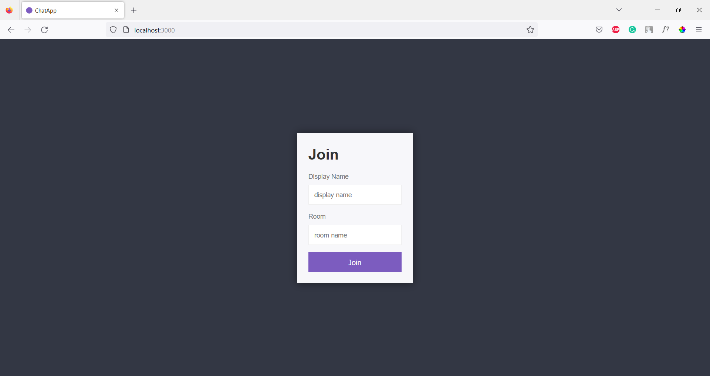

<h1 align="center">Welcome to  Chatapp 👋</h1>
<p>
  
  <a href="#" target="_blank">
    
  </a>
</p>

>  A real time chat app that allows users to chat in a private room.

## Images

<br>


<br>


<br>

## Install

```sh
npm install
```

## Usage

```sh
npm start
```

## Test

```sh
npm run dev
```

## Author

👤 **Divyansh**


## Show your support

Give a ⭐️ if this project helped you!

## Contributing
Pull requests are welcome. For major changes, please open an issue first to discuss what you would like to change.
